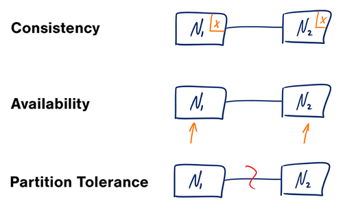
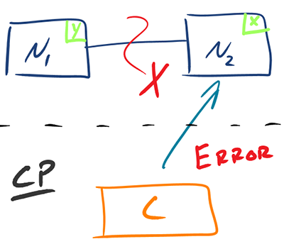
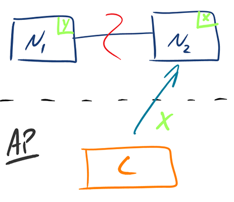

<Frame>
    </img>
</Frame>

**In a distributed computer system, you can only support two of the following guarantees:**

- `Consistency` - Every read receives the most recent write or an error
- `Availability` - Every request receives a response, without a guarantee that it contains the most recent version of the information
- `Partition Tolerance` - The system continues to operate despite arbitrary partitioning due to network failures

<Info>
    Networks aren't reliable, so you'll need to support partition tolerance. You'll need to make a software tradeoff
    between consistency and availability.
</Info>

### CP - consistency and partition tolerance
Waiting for a response from the partitioned node might result in a timeout error. CP is a good choice if your business
needs require atomic reads and writes.

<Frame>
    </img>
</Frame>

### AP - availability and partition tolerance
Responses return the most readily available version of the data available on any node, which might not be the latest.
Writes might take some time to propagate when the partition is resolved.

<Frame>
    </img>
</Frame>
