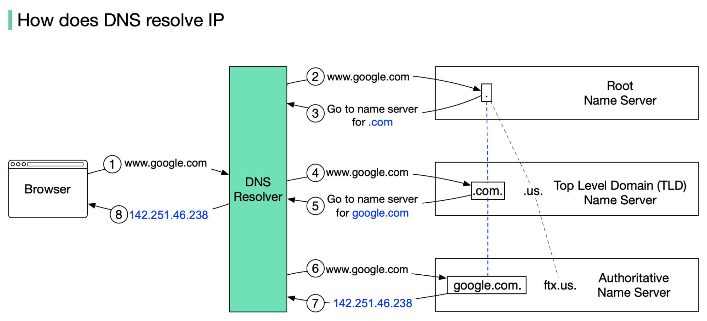

**A Domain Name System (DNS) translates a domain name such as www.example.com to an IP address.**

<Frame>
    
</Frame>

DNS is hierarchical, with a few authoritative servers at the top level. Your router or ISP provides information about
which DNS server(s) to contact when doing a lookup. Lower level DNS servers cache mappings, which could become stale
due to DNS propagation delays. DNS results can also be cached by your browser or OS for a certain period of time,
determined by the time to live (TTL).

- `NS record` (name server) - Specifies the DNS servers for your domain/subdomain.
- `MX record` (mail exchange) - Specifies the mail servers for accepting messages.
- `A record` (address) - Points a name to an IP address.
- `CNAME` (canonical) - Points a name to another name or CNAME (example.com to www.example.com) or to an A record.

Services such as CloudFlare and Route 53 provide managed DNS services. Some DNS services can route traffic through
various methods:
* Weighted round-robin
    * Prevent traffic from going to servers under maintenance
    * Balance between varying cluster sizes
    * A/B testing
* Latency-based
* Geolocation-based

### How DSN performs a lookup
DNS acts as an address book. It translates human-readable domain names (google.com) to machine-readable IP addresses (142.251.46.238).

To achieve better scalability, the DNS servers are organized in a hierarchical tree structure.

<Frame>
    
</Frame>

There are 3 basic levels of DNS servers:

1. Root name server (.). It stores the IP addresses of Top Level Domain (TLD) name servers. There are 13 logical root name servers globally.

2. TLD name server. It stores the IP addresses of authoritative name servers. There are several types of TLD names. For example, generic TLD (.com, .org), country code TLD (.us), test TLD (.test).

3. Authoritative name server. It provides actual answers to the DNS query. You can register authoritative name servers with domain name registrar such as GoDaddy, Namecheap, etc.

The diagram below illustrates how DNS lookup works under the hood:

1. google.com is typed into the browser, and the browser sends the domain name to the DNS resolver.

2. The resolver queries a DNS root name server.

3. The root server responds to the resolver with the address of a TLD DNS server. In this case, it is .com.

4. The resolver then makes a request to the .com TLD.

5. The TLD server responds with the IP address of the domain’s name server, google.com (authoritative name server).

6. The DNS resolver sends a query to the domain’s nameserver.

7. The IP address for google.com is then returned to the resolver from the nameserver.

8. The DNS resolver responds to the web browser with the IP address (142.251.46.238) of the domain requested initially.

DNS lookups on average take between 20-120 milliseconds to complete (according to YSlow).

### DNS Architecture
[Read here](https://learn.microsoft.com/en-us/previous-versions/windows/it-pro/windows-server-2008-R2-and-2008/dd197427(v=ws.10)?redirectedfrom=MSDN)

### Disadvantage(s): DNS
- Accessing a DNS server introduces a slight delay, although mitigated by caching described above.
- DNS server management could be complex and is generally managed by governments, ISPs, and large companies.
- DNS services have recently come under DDoS attack, preventing users from accessing websites such as Twitter without knowing Twitter's IP address(es).